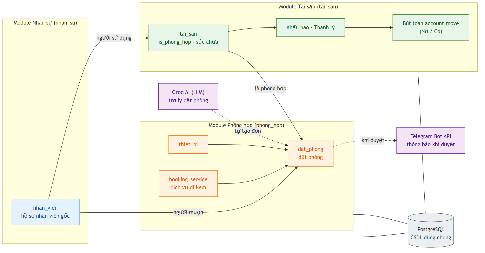

<h2 align="center">
    <a href="https://dainam.edu.vn/vi/khoa-cong-nghe-thong-tin">
    🎓 Faculty of Information Technology (DaiNam University)
    </a>
</h2>
<h2 align="center">
    ERP: QUẢN LÝ TÀI SẢN VÀ QUẢN LÝ PHÒNG HỌP
</h2>
<div align="center">
    <p align="center">
        
        
        
    </p>

[](https://www.facebook.com/DNUAIoTLab)
[](https://dainam.edu.vn/vi/khoa-cong-nghe-thong-tin)
[](https://dainam.edu.vn)

</div>

---

## 📖 1. Giới thiệu

Hệ thống được xây dựng trên nền tảng mã nguồn mở **Odoo 15**, thuộc đề tài **Đề 6 — Quản lý Tài sản và Quản lý Phòng họp** của học phần Thực tập doanh nghiệp (Khoa CNTT – Đại học Đại Nam). Hệ thống mô phỏng một doanh nghiệp cần quản lý tài sản (laptop, thiết bị, phòng họp…) và điều phối phòng họp dùng chung, với dữ liệu nhân sự là nguồn gốc dùng chung.

Các chức năng chính của hệ thống:

- **(Mức 1 – Tích hợp dữ liệu)** Liên kết chặt chẽ 03 module lõi (Nhân sự – Tài sản – Phòng họp) trên một cơ sở dữ liệu dùng chung, lấy hồ sơ nhân sự làm nguồn gốc để hình thành luồng nghiệp vụ thống nhất.
- **(Mức 2 – Tự động hóa quy trình)** Tự động chống trùng lịch phòng, trùng thiết bị và vượt sức chứa; tự động sinh **bút toán kế toán (`account.move`)** khi khấu hao và thanh lý tài sản; tự động hóa quy trình duyệt và vòng đời tài sản.
- **(Mức 3 – Ứng dụng AI)** Trợ lý đặt phòng thông minh tích hợp **Groq AI (LLM)**: nhập yêu cầu bằng tiếng Việt tự nhiên, hệ thống tự bóc tách và gợi ý phòng, thiết bị phù hợp.
- **(Mức 3 – Kết nối API)** Tự động gửi thông báo qua **Telegram Bot API** khi đơn đặt phòng được duyệt; hỗ trợ **dịch vụ đi kèm** (trà, cà phê, máy chiếu…) khi đặt phòng.

## 🏗️ 2. Kiến trúc hệ thống

Hệ thống gồm 03 module Odoo chia sẻ chung cơ sở dữ liệu PostgreSQL:

| Module | Mô tả | Phụ thuộc |
|--------|-------|-----------|
| **`nhan_su`** | Nền tảng HRM — model `nhan_vien` là "trái tim" dữ liệu (hợp đồng, phụ cấp, chấm công, nghỉ phép, phiếu lương, lịch sử công tác, chứng chỉ). | base, mail |
| **`tai_san`** | Quản lý tài sản: mượn/trả, bảo trì, điều chuyển, khấu hao, thanh lý; sinh bút toán `account.move`. Tài sản có cờ `is_phong_hop` để trở thành phòng họp. | base, mail, **account**, nhan_su |
| **`phong_hop`** | Đặt/duyệt phòng họp, thiết bị, dịch vụ đi kèm; trợ lý AI Groq; thông báo Telegram. | base, nhan_su, tai_san |

> Điểm tích hợp đặc trưng của Đề 6: mỗi **phòng họp đồng thời là một tài sản** (đánh dấu `is_phong_hop`), nên 3 module cùng chia sẻ một cơ sở dữ liệu và mọi liên kết nhân viên đều trỏ về model `nhan_vien`.

<p align="center">
  
</p>

Sơ đồ luồng nghiệp vụ end-to-end (Swimlane): [docs/businessflow/](docs/businessflow/)

## 🔧 3. Công nghệ sử dụng

<div align="center">

### Hệ điều hành
[](https://ubuntu.com/)
[](https://www.docker.com/)
### Công nghệ chính
[](https://www.odoo.com/)
[](https://www.python.org/)
[](https://developer.mozilla.org/en-US/docs/Web/JavaScript)
[](https://www.w3.org/XML/)
### Cơ sở dữ liệu & AI / API
[](https://www.postgresql.org/)
[](https://groq.com/)
[](https://core.telegram.org/bots/api)
</div>

## ⚙️ 4. Cài đặt

Cách nhanh nhất để chạy thử là dùng **Docker** (Odoo 15 + PostgreSQL 13) đã cấu hình sẵn trong `docker-compose.run.yml`.

### 4.1. Tải mã nguồn
```bash
git clone https://github.com/Q-Huy205/HN-QTDN-17-03-N6.git
cd HN-QTDN-17-03-N6
```

### 4.2. Khởi động hệ thống bằng Docker
```bash
docker compose -f docker-compose.run.yml up -d
```
Truy cập **http://localhost:8069** — đăng nhập `admin` / `admin` (khi tạo CSDL mới).

## 📦 5. Cài đặt các module

Cài 03 module của dự án (module `account` sẽ được Odoo tự cài kèm do `tai_san` phụ thuộc):

```bash
docker compose -f docker-compose.run.yml run --rm odoo \
  odoo -i account,nhan_su,tai_san,phong_hop -d ttdn \
  --db_host=db --db_user=odoo --db_password=odoo --stop-after-init
```

Hoặc cài qua giao diện: vào **Apps**, gỡ bộ lọc *Apps*, tìm và cài lần lượt **Quản lý nhân sự → Quản lý tài sản → Quản lý phòng họp**.

### 5.1. Cấu hình AI Groq & Telegram (Mức 3)
Vào **Settings → Technical → System Parameters**, thêm các tham số:

| Key | Giá trị |
|-----|---------|
| `phong_hop.groq_api_key` | API key của Groq |
| `phong_hop.groq_model` | `llama-3.3-70b-versatile` |
| `phong_hop.telegram_bot_token` | Token bot Telegram |
| `phong_hop.telegram_chat_id` | Chat ID nhận thông báo |

> Nếu không cấu hình Groq, trợ lý AI tự chuyển sang bóc tách bằng regex (không gián đoạn nghiệp vụ).

## 📂 6. Cấu trúc thư mục

```
HN-QTDN-17-03-N6/
├── addons/
│   ├── nhan_su/              # Module Nhân sự (HRM)
│   │   ├── models/           # nhan_vien, hop_dong, cham_cong, phieu_luong...
│   │   └── views/
│   ├── tai_san/              # Module Tài sản
│   │   ├── models/           # tai_san, khau_hao, thanh_ly, but_toan_mixin...
│   │   └── views/            # ... but_toan.xml (bút toán account.move)
│   └── phong_hop/            # Module Phòng họp
│       ├── models/           # dat_phong, quan_ly_phong_hop, booking_service, thiet_bi
│       ├── wizards/          # phong_hop_ai_wizard (Groq AI)
│       └── views/
├── docs/
│   ├── businessflow/         # Sơ đồ luồng nghiệp vụ (Swimlane)
│   ├── poster/               # Sơ đồ kiến trúc, poster
│   └── logo/
├── scripts/
│   └── seed_demo.py          # Seed dữ liệu demo đầy đủ 3 module
├── docker-compose.run.yml    # Chạy thử local (Odoo 15 + PostgreSQL)
└── demoday.md                # Báo cáo nghiệp vụ & cải tiến
```

## ✨ 7. Tính năng nổi bật

**Mức 1 – Tích hợp hệ thống**
- Một danh sách nhân viên gốc (`nhan_vien`) dùng chung cho cả 3 module.
- Tài sản và đơn đặt phòng đều tham chiếu nhân viên trong HRM.
- Phòng họp chính là tài sản dùng chung (`is_phong_hop`).

**Mức 2 – Tự động hóa quy trình**
- Chống trùng lịch phòng, trùng thiết bị, vượt sức chứa khi đặt phòng.
- Vòng đời tài sản: mượn → bảo trì → điều chuyển → khấu hao (tự trừ giá trị) → thanh lý.
- **Sinh bút toán kế toán `account.move`** khi khấu hao (Nợ 6274/Có 2141) và thanh lý (Nợ 1111/Có 711).
- Tự hủy đơn trùng và ghi nhật ký (audit) khi duyệt.

**Mức 3 – AI & Kết nối ngoài**
- **Trợ lý AI Groq**: đặt phòng bằng câu lệnh tiếng Việt tự nhiên.
- **Thông báo Telegram** tự động khi duyệt đơn.
- **Dịch vụ đi kèm** (trà, cà phê, máy chiếu…) + tự tính tổng tiền dịch vụ.

## 🌱 8. Dữ liệu demo

Script [`scripts/seed_demo.py`](scripts/seed_demo.py) seed đầy đủ cả 3 module (idempotent):
- **Nhân sự:** 8 nhân viên (kèm ảnh + quản lý trực tiếp), hợp đồng + phụ cấp, lịch sử công tác, chứng chỉ, chấm công, nghỉ phép, tăng ca, phiếu lương.
- **Tài sản:** tài sản + khấu hao, phiếu mượn, bảo trì, điều chuyển, thanh lý.
- **Phòng họp:** phòng họp + thiết bị + dịch vụ đi kèm + đơn đặt phòng.

```bash
cat scripts/seed_demo.py | docker compose -f docker-compose.run.yml exec -T odoo \
  odoo shell -d ttdn --db_host=db --db_user=odoo --db_password=odoo --no-http
```

## 🧪 9. Kịch bản kiểm thử / Demo

| Nghiệp vụ | Đường dẫn | Kết quả mong đợi |
|-----------|-----------|------------------|
| Bút toán khấu hao | Tài sản → Quản lý phiếu → Khấu hao → *Tạo bút toán* | Sinh `account.move` Nợ 6274 / Có 2141 cân đối |
| Bút toán thanh lý | Tài sản → Quản lý phiếu → Thanh lý → *Tạo bút toán* | Sinh `account.move` Nợ 1111 / Có 711 |
| Dịch vụ đi kèm | Phòng họp → Đăng ký → Đăng ký mượn phòng | Tick dịch vụ → Tổng tiền dịch vụ tự cộng |
| Trợ lý AI | Phòng họp → Đăng ký → Trợ lý đặt phòng (AI) | Nhập câu tiếng Việt → gợi ý phòng/thiết bị |
| Chống trùng lịch | Tạo 2 đơn cùng phòng, cùng giờ → duyệt 1 đơn | Đơn còn lại tự bị hủy, ghi nhật ký |
| Thông báo Telegram | Duyệt một đơn đặt phòng | Nhận tin nhắn Telegram báo duyệt |

## 👥 10. Nhóm thực hiện

**Lớp:** CNTT 17-03 · **Nhóm:** N6

| Họ và tên | MSSV | Vai trò |
|-----------|------|---------|
| Trần Quang Huy | 1771020346 | Trưởng nhóm – tích hợp & phát triển |
| Dương Đức Cường | 1771020114 | Thành viên |

## 📝 11. License

© 2026 AIoTLab, Faculty of Information Technology, DaiNam University. All rights reserved.

---
