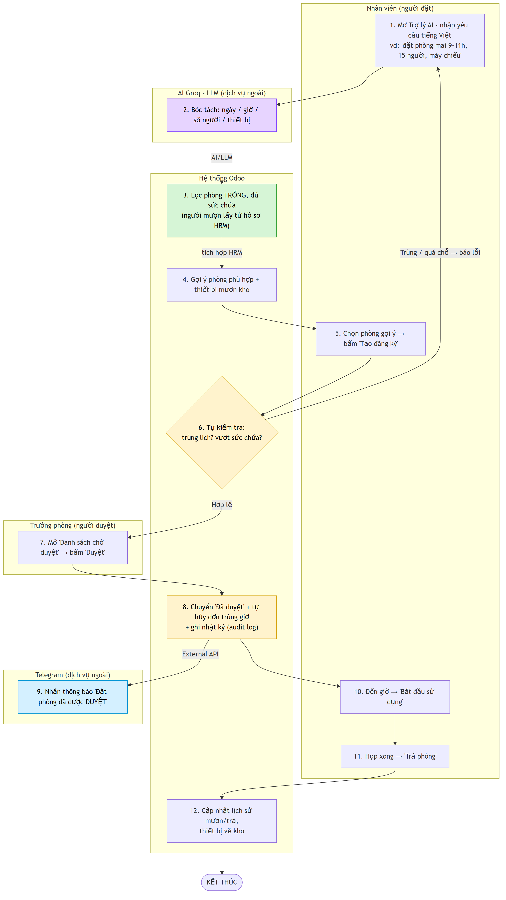

# Business Flow — Đề 6: Quản lý Tài sản + Phòng họp

**Mô tả:** Sơ đồ mô tả luồng nghiệp vụ **end-to-end "Đặt phòng họp bằng Trợ lý AI → Duyệt → Sử dụng → Trả phòng"**.
**Module tham gia:** `nhan_su` (HRM - dữ liệu gốc người mượn), `tai_san` (phòng họp là tài sản dùng chung + thiết bị), `phong_hop` (đặt phòng, duyệt, AI, thông báo).

## Chú thích điểm tích hợp
| Màu | Ý nghĩa | Bước |
|-----|---------|------|
| Tím | **AI/LLM** (Mức 3) – Groq bóc tách yêu cầu tiếng Việt | Bước 2 |
| Xanh dương | **External API** (Mức 3) – gửi thông báo Telegram | Bước 9 |
| Vàng | **Tự động hóa** (Mức 2) – kiểm tra trùng lịch/sức chứa, tự hủy đơn trùng + audit log | Bước 6, 8 |
| Xanh lá | **Tích hợp HRM** – người mượn lấy từ hồ sơ `nhan_vien` | Bước 3 |

## Luồng tóm tắt (happy path, 12 bước)
1. Nhân viên nhập yêu cầu tiếng Việt vào Trợ lý AI.
2. **AI Groq** bóc tách ngày/giờ/số người/thiết bị.
3. Hệ thống lọc phòng trống đủ sức chứa (người mượn từ **HRM**).
4. Gợi ý phòng + thiết bị cần mượn kho.
5. Nhân viên chọn phòng → Tạo đăng ký.
6. Hệ thống **tự kiểm tra** trùng lịch / vượt sức chứa.
7. Trưởng phòng bấm **Duyệt**.
8. Hệ thống chuyển "Đã duyệt", **tự hủy đơn trùng giờ**, ghi audit log.
9. Gửi **thông báo Telegram**.
10–11. Nhân viên bắt đầu sử dụng → trả phòng.
12. Cập nhật lịch sử mượn/trả, thiết bị về kho → Kết thúc.

> File nguồn sơ đồ: [`NhomN6_BusinessFlow_QuanLyTaiSan_PhongHop.mmd`](NhomN6_BusinessFlow_QuanLyTaiSan_PhongHop.mmd) (Mermaid).
> Vẽ lại/ xuất ảnh: dán nội dung `.mmd` vào https://mermaid.live rồi Export PNG/PDF.
